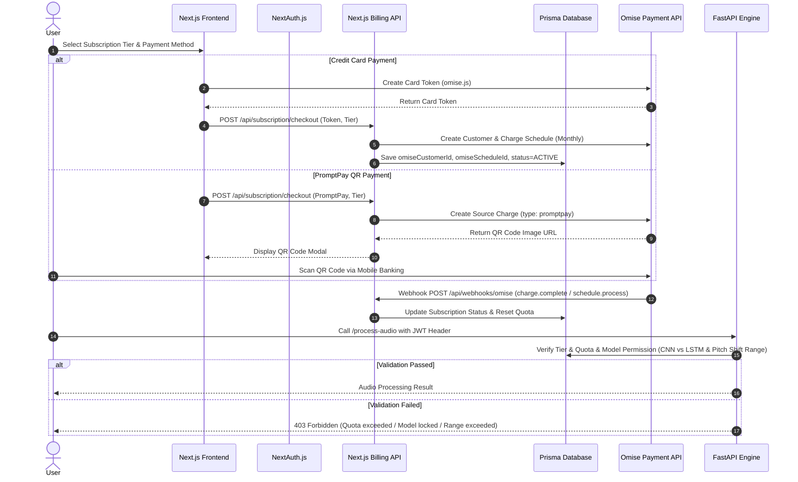

# Subscription & Billing System Design Spec (Omise + NextAuth + FastAPI)

**Date:** 2026-07-24  
**Status:** Approved  
**Project:** HarmoniQ (Music Separator & EQ/Compressor)

---

## 1. Executive Summary & Goals

HarmoniQ requires a robust subscription and usage quota management system to monetize music processing services. The system targets the Thai market using **Omise (Opn Payments)** as the sole payment gateway.

### Key Goals
- **3-Tier Subscription Model:** Free (3 songs/mo), Basic (99 THB/mo, 15 songs/mo), Pro (299 THB/mo, Unlimited).
- **Hybrid Payment Processing:** Automated monthly credit/debit card recurring billing via Omise Schedule API + Manual monthly PromptPay QR Code renewal.
- **Quota & Feature Restrictions:** Control song limits per month and restrict high-tier features (e.g., AutoEQ CNN model locked for Free tier users, Pitch Shift ranges, Compressor capabilities).
- **Seamless Auth Integration:** NextAuth.js (Auth.js) session tokens with Prisma ORM database.

---

## 2. Tier & Feature Permission Matrix

| Feature / Model | 🆓 Free Tier | 🥈 Basic Tier (99 THB/mo) | 🥇 Pro Tier (299 THB/mo) |
| :--- | :---: | :---: | :---: |
| **Monthly Song Separation Quota** | 3 songs / month (max 3 min) | 15 songs / month | **Unlimited** |
| **AutoEQ - LSTM Model** | ✅ Allowed (uses quota) | ✅ Allowed | ✅ Allowed |
| **AutoEQ - CNN Model** | 🔒 **Locked (HTTP 403)** | ✅ Allowed | ✅ Allowed |
| **Audio Compressor** | Basic Presets | Studio Compressor (Custom Knee/Gain) | Multiband Pro & Auto Knee |
| **Pitch Shift Range** | Limited (±2 Semitones) | Expanded (±6 Semitones) | Full Studio (±12 Semitones / Full Octave) |
| **Audio Export Quality** | MP3 / Standard WAV | Lossless WAV | Lossless WAV (High bitrate) |
| **AI Auto Mastering** | 🔒 Locked | 🔒 Locked | ✅ Full Features (LUFS & Peak Mastering) |

---

## 3. Database Schema (Prisma ORM)

```prisma
datasource db {
  provider = "sqlite" // SQLite for local dev, PostgreSQL for production
  url      = env("DATABASE_URL")
}

generator client {
  provider = "prisma-client-js"
}

model User {
  id               String        @id @default(cuid())
  name             String?
  email            String        @unique
  image            String?
  omiseCustomerId  String?       // Omise Customer ID
  subscription     Subscription?
  usageQuotas      UsageQuota[]
  createdAt        DateTime      @default(now())
  updatedAt        DateTime      @updatedAt
}

model Subscription {
  id                 String             @id @default(cuid())
  userId             String             @unique
  user               User               @relation(fields: [userId], references: [id], onDelete: Cascade)
  tier               String             @default("FREE")
  status             String             @default("ACTIVE")
  paymentMethod      String?
  omiseScheduleId    String?            // For Card Auto-recurring schedule
  currentPeriodStart DateTime           @default(now())
  currentPeriodEnd   DateTime?
  createdAt          DateTime           @default(now())
  updatedAt          DateTime           @updatedAt
}

model UsageQuota {
  id           String   @id @default(cuid())
  userId       String
  user         User     @relation(fields: [userId], references: [id], onDelete: Cascade)
  monthlyQuota Int      // Free=3, Basic=15, Pro=-1 (Unlimited)
  usedCount    Int      @default(0)
  periodStart  DateTime
  periodEnd    DateTime
}

enum SubscriptionTier {
  FREE
  BASIC
  PRO
}

enum SubscriptionStatus {
  ACTIVE
  PAST_DUE
  EXPIRED
  CANCELED
}

enum PaymentMethod {
  CREDIT_CARD
  PROMPTPAY
}
```

---

## 4. Architecture & Payment Flow



---

## 5. API Endpoints Specification

### Next.js API Routes
1. `POST /api/subscription/checkout`
   - **Body:** `{ tier: "BASIC" | "PRO", paymentMethod: "CREDIT_CARD" | "PROMPTPAY", cardToken?: string }`
   - **Response:** `{ success: true, qrCodeUrl?: string, subscriptionId: string }`
2. `POST /api/webhooks/omise`
   - **Headers:** `X-Omise-Signature`
   - **Handler:** Handles `charge.complete`, `charge.failed`, `schedule.process` events to update user subscription status and quotas.
3. `GET /api/subscription/status`
   - **Response:** `{ tier: string, status: string, usedQuota: number, maxQuota: number, periodEnd: string }`

### FastAPI Backend Integration
1. `POST /process-audio`
   - Checks `Authorization: Bearer <jwt_token>` decoded session.
   - Restricts `model_type == "CNN"` when `tier == FREE`.
   - Restricts Pitch Shift range > ±2 semitones when `tier == FREE`.
   - Rejects request when `usedQuota >= maxQuota` (unless unlimited).

---

## 6. Error Handling & Security

- **Webhook Verification:** Verify `X-Omise-Signature` using Omise Secret Key to prevent fraudulent webhook payloads.
- **Failed Recurring Charges:** If Omise Schedule charge fails, status changes to `PAST_DUE`. User receives banner notification in UI to update payment info.
- **Grace Period:** 3-day grace period for PromptPay renewal before status automatically flips to `EXPIRED` (reverting user back to `FREE` tier limits).
